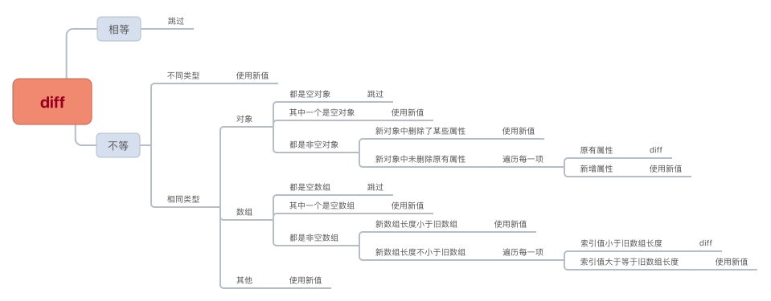

# redux-miniprogram-bindings


适用于小程序的 [Redux](https://github.com/reduxjs/redux) 绑定辅助库

## 特性

- API 简单灵活，只需一个 connect 即可轻松使用
- 功能完善，提供了多种使用方式，可满足不同的需求和使用场景
- 支持在 XML 中使用
- 执行 dispatch 后所有未销毁的页面(或组件)内部状态自动更新，视图自动更新渲染
- 自动进行 diff 优化和批量队列更新处理，性能优异
- 同时支持 `微信小程序` 和 `支付宝小程序`

## 安装

- 通过 `npm` 或 `yarn` 安装

  ```bash
  # npm
  $ npm install --save redux-miniprogram-bindings redux
  # yarn
  $ yarn add redux-miniprogram-bindings redux
  ```

- 直接引入 `dist` 目录下对应的 `redux-miniprogram-bindings` 文件，同时需要引入 [redux](https://github.com/reduxjs/redux) 文件

## 使用

1. 创建 Redux 的 Store 实例

2. 在 `app.js` 文件中设置 provider

   ```js
   import store from 'your/store/path'
   // 微信小程序
   import { setProvider } from 'redux-miniprogram-bindings'
   // 支付宝小程序
   import { setProvider } from 'redux-miniprogram-bindings/dist/redux-miniprogram-bindings.alipay.min.js'

   // 在其它依赖 store 的代码之前调用
   setProvider({ store })

   // ...

   App({})
   ```

3. 在页面中使用

   ```js
   import { connect } from 'redux-miniprogram-bindings'
   import { actionCreator1, actionCreator2 } from 'your/store/action-creators/path'

   connect({
     mapState: ['dependent', 'state'],
     mapDispatch: {
       methodsName1: actionCreator1,
       methodsName2: actionCreator2,
     },
   })({
     onLoad() {
       // 读取 state 中的值
       const { dependent } = this.data
       // dispatch actionCreator1
       this.methodsName1()
       // dispatch actionCreator2
       this.methodsName2(/** ...args */)
     },
   })
   ```

4. 在组件中使用

   ```js
   import { connect } from 'redux-miniprogram-bindings'
   import { actionCreator1, actionCreator2 } from 'your/store/action-creators/path'

   connect({
     type: 'component',
     mapState: [
       (state) => ({
         data1: state.dependent,
         data2: state.state,
       }),
     ],
     mapDispatch: (dispatch) => ({
       methodsName1: () => dispatch(actionCreator1()),
       methodsName2: (...args) => dispatch(actionCreator2(...args)),
     }),
   })({
     attached() {
       // 读取 state 中的值
       const { data1: dependent } = this.data
       // dispatch actionCreator1
       this.methodsName1()
       // dispatch actionCreator2
       this.methodsName2(/** ...args */)
     },
   })
   ```

5. 在 XML 中使用

   ```html
   <view wx:if="{{ data1 }}">{{ data2 }}</view>
   ```

6. 详细用法请参考 [`API`](#API) 介绍和 [`示例`](https://github.com/DPFlying/redux-miniprogram-bindings/tree/master/example)

## API

### setProvider - 配置 store

- store：`Object`

  Redux 的 Store 实例对象，必传

- namespace：`string`

  命名空间，默认为空。当设置命名空间后，会将所有依赖的 state 数据存放到以命名空间字段值为 key 的对象中，此时读取 state 值需要加上命名空间字段值

  例如设置 `namespace: '$store'` ，那么在页面(或组件)中获取依赖的 state 值需要使用 `this.data.$store.xxx` 形式

  > 命名空间存在的意义：
  >
  > - 明确哪些是 store 中的数据，哪些是 data 中的数据
  > - store 中的数据必须通过 dispatch 触发更新，可以避免无意中使用 `this.setData` 造成 store 中的数据更新，因为更新时需要加上额外的命名空间前缀

- manual：`boolean`

  是否需要手动调用 `Page()` 和 `Component()`，默认为 `false`。当设置为 `true` 时，`connect` 会返回处理好的传入的 options 对象，需要主动调用 `Page()` 或 `Component()` 进行实例注册。这为使用者自定义扩展提供了途径。如果 `connect` 中也配置了该属性，会覆盖此处的配置，以 `connect` 中的配置为准

  ```js
  Page(
    connect({
      manual: true,
    })({}),
  )
  ```

### connect - 连接 store

- type：`"page" | "component"`

  所连接实例的类型，可选值：`page`、`component`，默认为 `page`

- mapState：`(string | ((state: Object) => Object))[]`

  实例依赖的 state，可选。会将依赖的 store 数据注入到 data 中，并在后续状态改变时自动更新

  - 数组中的字符串：字符串为依赖的 state 的相应的 key 值，页面(或组件)会在依赖的 state 发生改变时自动更新状态和队列批量触发视图渲染

    ```js
    {
      mapState: ['state1', 'state2']
    }
    ```

  - 数组中的函数：函数接收 state 作为参数，可通过 state 获取到最新的状态数据，该函数必须返回一个对象，对象中的每一项可以是任意值，一般是根据 state 组合的数据。该方式会在 store 数据发生改变(并非一定是当前实例依赖的状态发生改变)时执行函数，然后对函数返回的结果和现有 data 中的数据进行 diff 比较，确认发生改变后队列批量更新渲染

    > 注意：函数会在每次 store 数据发生改变时调用，请确保函数足够的小和快。出于性能优化，建议多使用字符串形式，减少使用函数形式，必要时将两种形式混合使用。

    ```js
    {
      mapState: [
        (state) => ({
          region: state.province + state.city + state.area,
          name: state.userInfo.name,
        }),
      ]
    }
    ```

  - 字符串和数字混合

    ```js
    {
      mapState: [
        'name',
        (state) => ({
          region: state.province + state.city + state.area,
        }),
      ]
    }
    ```

- mapDispatch：`Object | dispatch => Object`

  注入可执行的 dispatch 处理函数或任意函数，可选

  - 对象形式：key 值为自定义函数名，实例内部可以通过该名称访问该方法，value 值为 `actionCreator` 函数。会将 actionCreator 函数包装成自动调用 disptach 的函数，并注入到实例方法中

    ```js
    // 配置
    mapDispatch: {
      methodsName1: actionCreator1,
      methodsName2: actionCreator2,
    }

    // 调用
    this.methodsName1()
    // 相当于
    dispatch(actionCreator1())

    // 调用
    this.methodsName2(a, b, c)
    // 相当于
    dispatch(methodsName2(a, b, c))
    ```

  - 函数形式：函数接收 dispatch 作为参数，返回一个对象，包含自定义整理后的处理函数

    ```js
    // 配置
    mapDispatch: (dispatch) => ({
      methodsName1: () => dispatch(actionCreator1()),
      methodsName2: (...args) => dispatch(actionCreator2(...args)),
    })

    // 调用
    this.methodsName1()
    this.methodsName2(a, b, c)
    ```

  > **注意：** 通过 mapDispatch 注入的函数也可以在 XML 中作为事件处理函数使用。如果函数需要传递参数时请注意，事件处理函数默认会传入 `event` 对象作为函数的第一个参数

  ```html
  <view bind:tap="handleAdd">Add</view>
  ```

- manual：`boolean`

  是否需要手动调用 `Page()` 或 `Component()`，默认值为 `setProvider` 中配置的值或 `false`

### \$page - connect Page 的别名

```js
$page()({})
// 相当于
connect({ type: 'page' })({})
```

### \$component - connect Component 的别名

```js
$component()({})
// 相当于
connect({ type: 'component' })({})
```

### Utils

工具函数，调用时请确保已经在 `app.js` 文件中调用了 `setProvider`

#### useStore - 获取 store 实例对象

```js
import { useStore } from 'redux-miniprogram-bindings'

const store = useStore()
```

#### useState - 获取当前 state 对象

```js
import { useState } from 'redux-miniprogram-bindings'

const state = useState()
```

#### useDispatch - 获取 dispatch 函数

```js
import { useDispatch } from 'redux-miniprogram-bindings'

const dispatch = useDispatch()
```

#### useSubscribe - 添加 store 订阅

useSubscribe 接收一个回调函数，该函数会在 store 数据发生改变时调用，该函数接收两个参数，分别是当前状态 currState 和之前状态 prevState，通过对比两者进行细化监听

useSubscribe 返回一个函数，调用该函数终止订阅

```js
import { useSubscribe } from 'redux-miniprogram-bindings'

$page()({
  onLoad() {
    // 启用订阅
    this.unsubscribe = useSubscribe((currState, prevState) => {
      if (currState.userInfo.name !== prevState.userInfo.name) {
        console.log('userName change')
      }
    })
  },

  onUnload() {
    // 解除订阅
    this.unsubscribe()
  },
})
```

#### useRef - 获取状态的引用

useRef 接收一个 selector 函数，该函数接收 state 作为参数，可以返回任意值(建议返回使用 state 组装的数据)

useRef 返回一个 Ref 对象，该对象拥有一个只读的 value 属性，通过该属性可以得到 selector 函数返回的最新值

```js
const selector = (state) => state.userInfo.name
const userNameRef = useRef(selector)

setInterval(() => {
  // 不管 state 数据是否发生改变
  // 得到的永远是 state.userInfo.name 的最新值
  console.log(userNameRef.value)
}, 1000)
```

也可以通过如下方式实现相同功能

```js
import { useState } from 'redux-miniprogram-bindings'
const selector = (state) => state.userInfo.name
const getUserName = () => selector(useState())

setInterval(() => {
  // 不管 state 数据是否发生改变
  // 得到的永远是 state.userInfo.name 的最新值
  console.log(getUserName())
}, 1000)
```

具体使用哪种方式完全看个人喜好，这里只是提供了一个工具方法

## diff 逻辑


